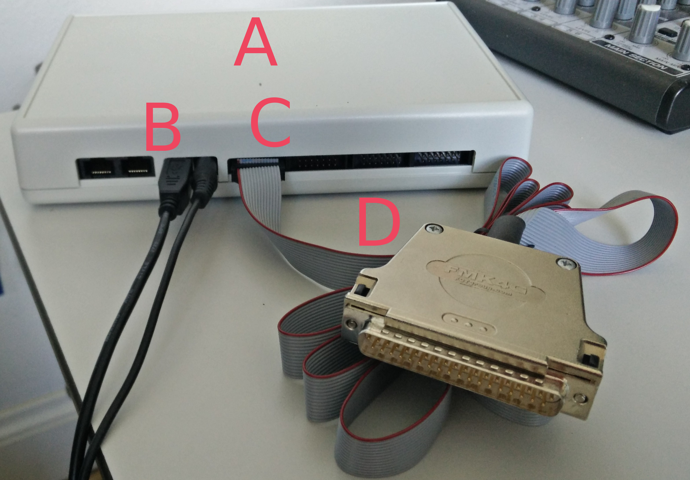

# ZEP-EEG-Marker-Module

This [Zep](https://www.beexy.nl/zep/wiki/doku.php) module provides a way
to send markers (i.e. triggers) from your Zep experiment to a parallel input port. One such input port is the USB receiver of the BioSemi EEG equipment. This allows you to send markers with Zep! Jeej.

## Requirements
*   Zep version 1.14.4 or later
*   [BeexyBox type X](https://www.beexy.nl/responseboxes/)

## Usage Instructions
1.  Copy the file `eeg_markers.zm` from this repository to a location found by your experiment(_e.g._ your experiment's `/modules` directory).
1.  Within your experiment import the module by adding `import eeg_markers;` to
the top of your `.zp` file.
1.  Within your experiment script, after setting up the presentation of a
stimuli add the following function call: `setup_marker_at(<int marker> ,<time tref>);`.
With _marker_ being the integer you want to send and _tref_ set to the _expected_start_time_ of the stimulus you have setup.

# Troubleshooting
Below are some common problems and their solutions. If these do not work please ask
your technician for help. Make sure you run the experiment in such a way you can see the error output of Zep. This module outputs _WARNINGS_ and _ERRORS_ that might explain trouble.

### Module cannot find the device

#### Check the connections
[</img>](readme_images/BeexyBoxX.jpg)

The BeexyBox X (`A`) requires three connections:
*   (`B`) The USB connection to the stimulus-presenting computer. If possible USB 3.x.
*   (`C`) The power-adapter connection. BeexyBox X does not use power-over-USB.
*   (`D`) The output connection. The 10-pin digital out needs to connect to the
first 10 pin of the parallel port. Here we use a ribbon cable and a 37-pin sub-d connector.

#### Check the connection using beexymonitor
Use beexymonitor (utility for configuring, monitoring and testing BeexyBox devices) to see if you can actually connect to the BeexyBox.

#### Check the `DEVICE_ADDRESS`
Sometimes the BeexyBox X device is not automagically found.
If this is the case you might need to define the device address manually.
Do this by setting the `DEVICE_ADDRESS` at the top of the `eeg_marker.zm` file.
This variable is `""` by default and indicates automatic lookup.

For Linux-based operating systems the address is generally one of:
*   _/dev/ttyACM0_
*   _/dev/ttyACM1_
*   ...

For Windows-based operating systems the address is generally one of:
*   _COM1_
*   _COM2_
*   ...

### Errors when sending more than one marker at the same time
Sending two markers at the same time is not possible. Hence there is a minimal
required interval between two markers. This interval is half the pulse length of the first
marker. The only solution is to redesign your experiment.

### The timing of the markers varies a lot
Make sure you avoid using `send_marker()`. Use `send_marker()` if you want to insert a marker and care nothing for the accuracy of timing.

Try to use `setup_marker_at()` with the _expected_start_time_ of your stimulus object.
If using this function creates variation creates jitter something might be wrong with the way you setup the stimulus objects. Make sure you check for discrepancies between the _expected_start_time_ and the actual _start_time_ of you stimulus objects.

### EEG recordings with ActiView (Biosemi Software) suddenly pauses for no good reason
ActiView can be [configured](https://www.biosemi.com/faq/trigger_signals.htm) to start a pause or stop a pause on specific markers.
Check the .cfg you feed Actiview for the following:

     Example of .cfg text:
     PauseOff="254 //-1 is disabled, 0-255 is enabled"
     PauseOn="255 //-1 is disabled, 0-255 is enabled"
